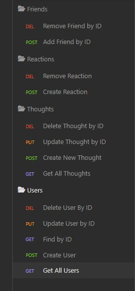
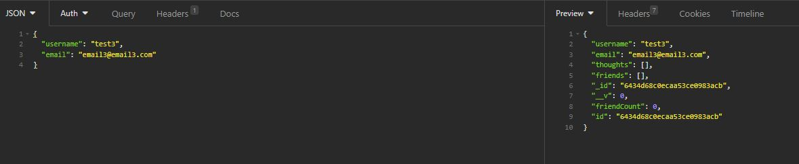

# Social-Network-API 4/10/2023

## Description

This project is an local application that allows a user to use the CRUD operations (Create, Read, Update, and Delete) on a Social Network API using Mongoose and MongoDB. This application is ran using node.js and is interacted with via Insomnia and the corresponding request methods along with JSON.

## Table of Contents

[Badges](#badges)

[Visuals](#visuals)

[Installation](#installation)

[Usage](#usage)

[Support](#support)

[Contribution](#contribution)

[Authors](#authors)

[License](#license)

<a name="badges"/>

## Badges

N/A

<a name="visuals"/>

## Visuals

A video demo of the application can be found on the following link [here.](https://drive.google.com/file/d/1J5jO53uaHhuGMCFmNAEoAS14BzYGz3au/view)

<a name="installation"/>

## Installation

This project can be cloned from my GitHub repo link found at the bottom of this project's README file. Once installed node, package.json files, nodemon, express.js, mongoose and mongoDb are required to be installed to be able to run this application locally.

Once cloned a command of "node install" can be run in the terminal to install the necessary dependencies of this project. However MongoDB will have to be installed seperately.

<a name="usage"/>

## Usage

This project could be used to store, update, delete and display user information for the beginnings of a new social network site/app. The application takes JSON via Insomnia to create and update the data stored locally. Using the JSON and corresponding routes to the api on Insomnia; MongoDB data is generated, stored, updated, and deleted in the corresponding database and tables.

Once all necessary files are cloned and the package dependencies are installed, the user can run a command of "npm run seeds" in the terminal to create the starter data in the database. After this, the user can use a command of "npm run dev" or "npm start" to begin listening on the corresponding PORT.

From there Insomnia will be the main interface for interacting with the database.

<a name="support"/>

## Support

N/A

<a name="contribution"/>

## Contributing

The GitHub Repository can be found on the following this link [here.](https://github.com/aguilarj5/Social-Network-API)

<a name="authors"/>

## Authors and acknowledgment

GitHub: aguilarj5

Express Documentation link: https://expressjs.com/en/api.html

NPM api link: https://www.npmjs.com/

Insonmia link: https://insomnia.rest/

Mongoose Documentation Link: https://mongoosejs.com/

<a name="license"/>

## License

N/A
